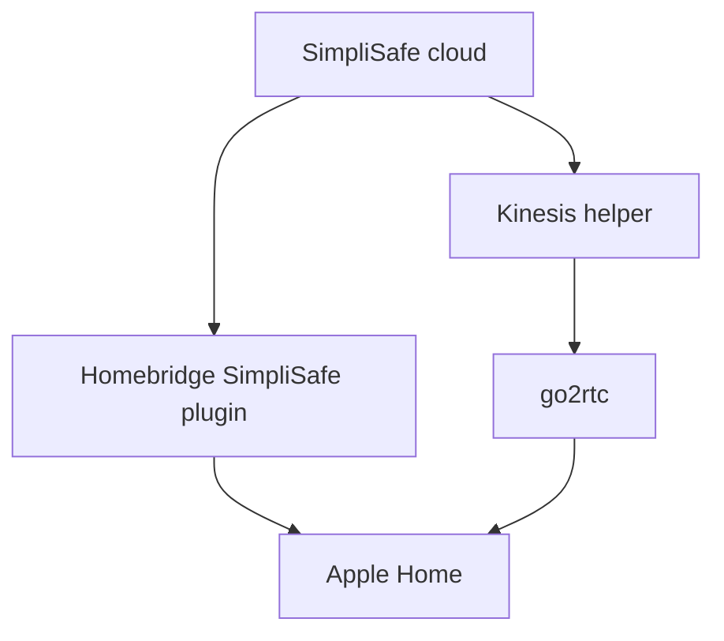

# Architecture

Homebridge owns alarm, sensor, lock and Video Doorbell Pro accessories. The
camera helper requests a short-lived, signed Kinesis WebRTC endpoint only when
go2rtc needs an Outdoor Camera stream. go2rtc converts the source into the H.264
and Opus combination expected by Apple Home.

The helper never proxies video through a project-operated server. Video flows
between SimpliSafe/AWS, the local bridge and the user's Apple devices.

## Trust boundaries

| Boundary | Data crossing it | Control |
| --- | --- | --- |
| User to SimpliSafe OAuth | Account login and approval | SimpliSafe-hosted login; password is never handled by this project |
| Bridge to SimpliSafe API | Refresh/access tokens, device metadata | TLS, private token file, minimal calls |
| SimpliSafe KVS to bridge | Camera video and audio | Short-lived signed endpoint and ICE credentials |
| Bridge to Apple Home | Local HomeKit accessory and media | HomeKit pairing and encrypted local session |

## Failure behaviour

- Invalid authentication stops stream creation and returns a non-zero status.
- Invalid or unsafe configuration prevents go2rtc configuration generation.
- The camera service refuses to start without a generated configuration.
- Alarm monitoring continues independently in the official SimpliSafe system.

